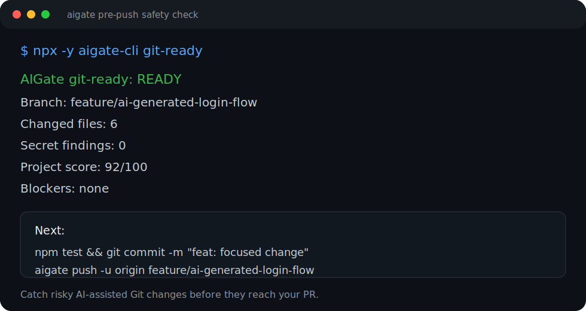
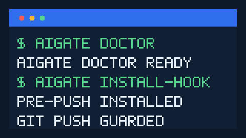

# AIGate

AI が生成した危険な Git 変更を push 前に止める CLI です。

[English](README.md) | [한국어](README.ko.md) | [日本語](README.ja.md) | [中文](README.zh.md)

HTML overview: <https://leehueeng.github.io/aigate-ai-git-workflow-guard-cli/>

AIGate は、AI コーディング支援を使う開発者向けの zero-config
pre-push safety CLI です。変更ファイル、secret リスク、リポジトリの
準備状況、PR リスク、ブランチ戦略を、remote branch や PR review に
届く前に確認します。





## AIGate が向いている場面

- AI coding assistant がレビュー速度より速くファイルを変更する。
- `git push` 前に readiness を説明する 1 つの command がほしい。
- 公開 package を運用し、PR、release、repository health signals が必要。
- Markdown、HTML、JSON、SARIF output を local と CI の両方で使いたい。
- Codex、Gemini、Claude Code に人間と同じ branch/validation workflow を守らせたい。

## 60 秒クイックスタート

インストールせずに実行できます。

```sh
npx -y aigate-cli check
npx -y aigate-cli start --route default --dry-run
npx -y aigate-cli start --route quickstart --dry-run
npx -y aigate-cli doctor
npx -y aigate-cli test
npx -y aigate-cli ai report
npx -y aigate-cli demo
npx -y aigate-cli pr-check
npx -y aigate-cli evaluate-project
```

グローバルにインストールする場合:

```sh
npm install -g aigate-cli
aigate start
aigate start --route default --ask-steps
aigate start --route default --steps init,repo-files
aigate start --route oss --dry-run
aigate reset --dry-run
aigate clean
aigate uninstall
aigate check
aigate test
aigate ai report
aigate aitest
aigate git-ready
aigate install-hook --pre-push
aigate pr-check
```

## 状況別プレイブック

| 状況 | プロセス | コマンド |
| --- | --- | --- |
| 新しいリポジトリに導入 | AIGate の基本ファイルを段階的に作成し、pre-push guard をインストールします。 | `aigate start --route default --ask-steps` -> `aigate doctor` -> `aigate install-hook --pre-push` |
| AI が多くのファイルを変更 | 変更パスを確認し、テストを実行して、失敗内容を AI 修正プロンプトにします。 | `aigate check` -> `aigate test` -> `aigate aitest --provider codex` |
| PR 直前 | gate を通し、AIGate 経由で push し、reviewer 向けの要約を作成します。 | `aigate git-ready` -> `aigate push -u origin feature/my-work` -> `aigate pr-check` |
| private GitLab monorepo | profile を固定し、turbo 実行環境を確認して workspace test に切り替え、GitHub/npm パッケージ検査を app score から外します。 | `aigate setup --hosting gitlab --ci-provider gitlab --project-type app --package-manager pnpm` -> `aigate test` -> `aigate evaluate-project` |
| オープンソース公開 | 公開貢献ファイルを作成し、リポジトリ基盤を確認します。 | `aigate start --route oss --owner @team` -> `aigate evaluate-project --deep --report` -> `aigate github setup --dry-run` |
| リリース週 | npm と tag の準備状態を確認し、CI 後にトレンドを記録します。 | `aigate release-check --npm` -> `npm run ci` -> `aigate trends record` |

## 現在使える機能

| 機能 | コマンド |
| --- | --- |
| ローカル Git readiness check | `aigate check` |
| ガイド付き設定ルーター | `aigate start` |
| はい/いいえで選ぶデフォルト設定 | `aigate start --route default --ask-steps` |
| 必要な手順だけを指定して実行 | `aigate start --route default --steps init,repo-files` |
| AIGate 設定と settings を初期化 | `aigate reset` |
| 生成済みローカルレポートと状態を削除 | `aigate clean --force` |
| AIGate 設定、ローカル状態、所有 hook を削除 | `aigate uninstall --force` |
| 公開リポジトリ README、issue テンプレート、貢献ファイル生成 | `aigate start --route oss` |
| turbo 実行環境の確認と workspace test への切り替え | `aigate test` |
| AI 修正プロンプトと任意の agent 実行 | `aigate aitest` |
| 現在の問題、良い点、方向性をまとめる AI レポート | `aigate ai report` |
| 初回実行 diagnostics | `aigate doctor` |
| ガイド付き CLI demo | `aigate demo` |
| pre-push safety gate | `aigate git-ready` |
| pre-push hook installer | `aigate install-hook --pre-push` |
| 検証付き push wrapper | `aigate push -u origin <branch>` |
| PR readiness report | `aigate pr-check` |
| GitHub PR 要約コメント | `aigate github comment --pr <number>` |
| GitHub Checks 要約 payload | `aigate github check --format json` |
| GitHub PR テンプレートと CODEOWNERS 設定 | `aigate github setup` |
| Markdown, HTML, JSON, SARIF report | `aigate report --format <format>` |
| repository health score | `aigate evaluate-project` |
| コンプライアンス統制レポート | `aigate compliance-report` |
| ローカル HTML ヘルスダッシュボード | `aigate dashboard` |
| プロジェクト状態トレンド履歴 | `aigate trends record` |
| private app、GitLab、pnpm の自動検出と npm パッケージ検査の除外 | `aigate setup --hosting gitlab` |
| ブランチ戦略ポリシーパック | `aigate branch-strategy --apply` |
| ブランチ戦略提案の比較 | `aigate branch-strategy --compare` |
| npm release readiness check | `aigate release-check --npm` |
| Codex/Gemini/Claude integration files | `aigate integrate all` |

## 他ツールとの違い

AIGate は Husky、Lefthook、pre-commit、Gitleaks を無理に置き換えません。
既存の hook や scanner の上で、AI-assisted changes の push safety、PR quality、
repository governance をまとめる workflow layer です。

詳しくは [tool comparison](docs/comparison.ja.md) を参照してください。

## 代表的な流れ

```sh
git switch -c feature/my-work
aigate ai report
aigate start --route default --ask-steps
aigate start --route oss --dry-run
aigate start --route ai --provider all
aigate reset --dry-run
aigate clean
aigate doctor
aigate install-hook --pre-push
aigate test
aigate aitest
aigate git-ready
git add <files>
git commit -m "feat: focused change"
aigate push -u origin feature/my-work
aigate pr-check --output .aigate/reports/pr.md
aigate pr --title "feat: focused change"
aigate github comment --pr <number>
aigate github check --output .aigate/reports/github-check.md
aigate trends record
aigate github setup --owner @your-org/team --dry-run
```

## 言語設定

CLI 出力は英語、韓国語、日本語、中国語に対応しています。

```sh
aigate setup --language en
aigate setup --language ko
aigate setup --language ja
aigate setup --language zh
```

## GitHub Actions

他のリポジトリでも、AIGate を再利用可能な公開 GitHub Action として実行
できます。

```yaml
name: AIGate
on:
  pull_request:
jobs:
  aigate:
    runs-on: ubuntu-latest
    steps:
      - uses: actions/checkout@v7
      - uses: LeeHueeng/aigate-ai-git-workflow-guard-cli@v0.1.6
        with:
          command: git-ready
          language: ja
```

安定運用では現在のリリースタグを使い、未リリースの最新動作を意図的に確認
したい場合だけ `@main` を使ってください。入力一覧は
[GitHub Action ドキュメント](docs/github-action.ja.md) にまとめています。

Action リリース状態:

- 現在の安定タグ: `v0.1.6`
- Action 利用: `LeeHueeng/aigate-ai-git-workflow-guard-cli@v0.1.6` で利用可能
- Marketplace 公開: GitHub Release 画面で手動で有効にする手順
- Action name: `AIGate AI Git Workflow Guard CLI`
- Primary category: `Code quality`
- Secondary category: `Security`
- Release title: `AIGate AI Git Workflow Guard CLI v0.1.6`

## AI エージェント連携

```sh
aigate integrate all
aigate ai report
aigate ai report --apply --provider codex
aigate aitest --provider codex
aigate aitest --apply --provider codex
```

このコマンドは `AGENTS.md`、`GEMINI.md`、`CLAUDE.md`、
`.aigate/integrations/*` を生成し、Codex、Gemini、Claude Code が同じ
branch、validation、guarded push workflow を守るようにします。`aigate aitest`
は `.aigate/reports/ai-test.md` に修正プロンプトを書き込み、`--apply` を
付けた場合だけ Codex、Claude、Gemini または独自 `--agent-command` を実行します。

`aigate ai report` は現在の Git 状態、リポジトリ基盤スコア、リリース準備、
ブランチ戦略、AI 引き継ぎプロンプトをまとめます。通常実行ではファイルを
変更せず、`--apply --provider codex|claude|gemini` を付けた場合だけ選択した
AI CLI を実行します。

`--apply` 実行中は、プロンプトのパス、provider、agent コマンド、リアルタイムの
agent 出力をターミナルに表示し、最終レポートにも stdout/stderr を残します。

## ドキュメント

- [多言語ドキュメント索引](docs/README.ja.md)
- [日本語使い方ガイド](docs/usage.ja.md)
- [日本語運用ドキュメント](docs/operations.ja.md)
- [Tool comparison](docs/comparison.ja.md)
- [English operations guide](docs/operations.en.md)
- [한국어 운영 문서](docs/operations.ko.md)
- [中文运维说明](docs/operations.zh.md)
- [Distribution guide](docs/distribution.ja.md)
- [Notifications guide](docs/notifications.ja.md)
- [AI integrations](docs/ai-integrations.ja.md)
- [JSON output example](docs/examples/json-output.ja.md)
- [Windows smoke test](docs/examples/windows-smoke-test.ja.md)
- [Release process](docs/release-process.ja.md)
- [Hotfix process](docs/hotfix-process.ja.md)
- [Roadmap](docs/roadmap.ja.md)

## 公開インストールチャネル

現在利用できる公開インストール経路です。

```sh
npm install -g aigate-cli
brew install LeeHueeng/tap/aigate-cli
docker run --rm -v "$PWD:/repo" -w /repo ghcr.io/leehueeng/aigate-cli:0.1.6 check
```

## まだ公開していない計画

- standalone binary
- hosted dashboard
- deeper Linear/Jira integrations

## AIGate の成長に協力する

- AIGate が risky push を防いだら、repository に star または watch をお願いします。
- 実際の repository での利用例を issue として共有してください。
- 紹介するときは demo GIF、terminal screenshot、`assets/social-preview.png` を使えます。
- docs、examples、integrations、packaging の good first issue から始められます。

## License

MIT
