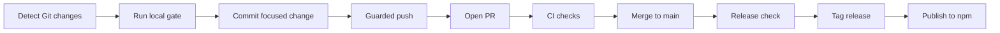
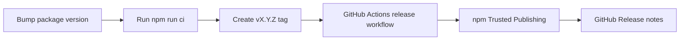

# AIGate Operations Guide

[English](operations.en.md) | [한국어](operations.ko.md) | [日本語](operations.ja.md) | [中文](operations.zh.md)

This GitHub-readable guide explains how AIGate runs, which commands are
available, what is implemented today, and what is planned next. The visual HTML
version is also available for local viewing at `docs/aigate-overview.en.html`.

## Operating Process



## Release Process



## Command Map

| Area | Commands |
| --- | --- |
| Setup | `init`, `setup`, `settings`, `integrate` |
| First run | `doctor`, `demo`, `install-hook --pre-push` |
| Guard gates | `check`, `git-ready`, `push`, `pr` |
| Reports | `pr-check`, `report`, `evaluate-project`, `audit-report` |
| Release | `release-check`, `release-check --npm`, `branch-strategy`, `notify` |

## Typical Command Path

```sh
npm install -g aigate-cli
aigate setup --language en
git switch -c feature/my-change
aigate doctor
aigate install-hook --pre-push
aigate git-ready
git add <files>
git commit -m "feat: short summary"
aigate push -u origin feature/my-change
aigate pr-check --output .aigate/reports/pr.md
aigate pr --title "feat: short summary"
aigate github comment --pr <number>
aigate github check --output .aigate/reports/github-check.md
aigate trends record
aigate github setup --owner @your-org/team --dry-run
aigate release-check --npm
```

## Implemented Today

- Public npm package `aigate-cli` and `npx` execution
- First-run diagnostics through `aigate doctor`
- Guided CLI demo through `aigate demo`
- Pre-push hook installation through `aigate install-hook --pre-push`
- Git changed-file and untracked-file readiness checks
- Secret pattern detection and SARIF output
- `git-ready`, guarded push, and guarded PR creation
- GitHub PR comments and Checks summaries through `aigate github`
- GitHub PR template and CODEOWNERS setup through `aigate github setup`
- Markdown, HTML, JSON, and SARIF reports
- Project score and deep Git signal evaluation
- Project health trend history through `aigate trends`
- Branch strategy recommendation and generated policy drafts
- Codex/Gemini integration file generation
- English, Korean, Japanese, and Chinese CLI settings
- Release checks and npm Trusted Publishing workflow
- Terminal, Slack BLOCK, Discord, and Teams webhook notifications

## Planned Next

- Published Docker image
- Homebrew formula
- Standalone binaries
- Linear/Jira integrations
- Hosted dashboard and enterprise governance packs
