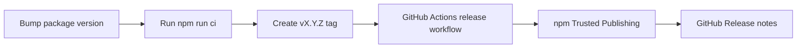

# AIGate Operations Guide

[English](operations.en.md) | [한국어](operations.ko.md) | [日本語](operations.ja.md) | [中文](operations.zh.md)

This GitHub-readable guide explains how AIGate runs, which commands are
available, what is implemented today, and what is planned next. The visual HTML
version is also available for local viewing at `docs/aigate-overview.en.html`.
For copy-and-run commands, start with the [usage guide](usage.md).

## Operating Process

```mermaid
flowchart LR
  A["Run aigate start"] --> B["Detect Git changes"]
  B --> C["Run aigate test"]
  C --> D["Run aitest if tests fail"]
  D --> E["Commit focused change"]
  E --> F["Guarded push"]
  F --> G["Open PR"]
  G --> H["CI checks"]
  H --> I["Merge to main"]
  I --> J["Release check"]
  J --> K["Tag release"]
  K --> L["Publish to npm"]
```



## Release Process



## Command Map

| Area | Commands |
| --- | --- |
| Setup | `start`, `start --route default`, `start --route oss`, `init`, `setup`, `settings`, `integrate` |
| First run | `doctor`, `demo`, `install-hook --pre-push` |
| Guard gates | `check`, `test`, `aitest`, `git-ready`, `push`, `pr` |
| Reports | `ai report`, `pr-check`, `report`, `evaluate-project`, `compliance-report`, `dashboard`, `audit-report` |
| Release | `release-check`, `release-check --npm`, `branch-strategy`, `branch-strategy --compare`, `notify` |

## Typical Command Path

```sh
npm install -g aigate-cli
aigate setup --language en
aigate ai report
aigate start --route default --ask-steps
aigate start --route oss --dry-run
aigate start --route ai --provider all
git switch -c feature/my-change
aigate doctor
aigate install-hook --pre-push
aigate test
aigate aitest
aigate git-ready
git add <files>
git commit -m "feat: short summary"
aigate push -u origin feature/my-change
aigate pr-check --output .aigate/reports/pr.md
aigate pr --title "feat: short summary"
aigate github comment --pr <number>
aigate github check --output .aigate/reports/github-check.md
aigate trends record
aigate compliance-report --output .aigate/reports/compliance.md
aigate dashboard --output .aigate/reports/dashboard.html
aigate branch-strategy --compare
aigate github setup --owner @your-org/team --dry-run
aigate release-check --npm
```

## Implemented Today

- Public npm package `aigate-cli` and `npx` execution
- First-run diagnostics through `aigate doctor`
- Guided start routes through `aigate start`
- Stepwise default setup through `aigate start --route default --ask-steps`
- Selected setup step execution through `aigate start --route default --steps init,repo-files`
- Open-source starter files through `aigate start --route oss`
- Guided CLI demo through `aigate demo`
- Pre-push hook installation through `aigate install-hook --pre-push`
- Git changed-file and untracked-file readiness checks
- Project test automation through `aigate test`
- AI project health briefs through `aigate ai report`
- AI remediation prompt and optional agent execution through `aigate aitest`
- Secret pattern detection and SARIF output
- `git-ready`, guarded push, and guarded PR creation
- GitHub PR comments and Checks summaries through `aigate github`
- GitHub PR template and CODEOWNERS setup through `aigate github setup`
- Reusable public GitHub Action through `action.yml`
- Markdown, HTML, JSON, and SARIF reports
- Compliance reports and a local HTML health dashboard
- Project score and deep Git signal evaluation
- Project health trend history through `aigate trends`
- Branch strategy recommendation, proposal comparison, and generated policy packs
- Codex/Gemini/Claude Code integration file generation
- English, Korean, Japanese, and Chinese CLI settings
- Release checks and npm Trusted Publishing workflow
- Terminal, Slack BLOCK, Discord, Teams, email, Linear, and Jira notifications
- GHCR Docker publish workflow and Homebrew formula draft

## Planned Next

- Public Docker image after a tagged GHCR workflow run
- Homebrew tap publication
- Standalone binaries
- Deeper Linear/Jira workflow integrations
- Organization dashboard and enterprise governance packs
