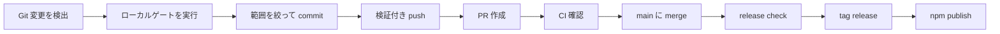
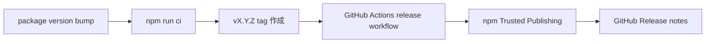

# AIGate 運用ドキュメント

[English](operations.en.md) | [한국어](operations.ko.md) | [日本語](operations.ja.md) | [中文](operations.zh.md)

このドキュメントは、GitHub 上でソースコードではなく文書として読める
運用ガイドです。ビジュアル版 HTML は、ローカルで
`docs/aigate-overview.ja.html` を開くと確認できます。

## 全体の運用プロセス



## リリースプロセス



## コマンドマップ

| 領域 | コマンド |
| --- | --- |
| Setup | `init`, `setup`, `settings`, `integrate` |
| Guard gates | `check`, `git-ready`, `push`, `pr` |
| Reports | `pr-check`, `report`, `evaluate-project`, `audit-report` |
| Release | `release-check`, `release-check --npm`, `branch-strategy`, `notify` |

## 代表的な実行手順

```sh
npm install -g aigate-cli
aigate setup --language ja
git switch -c feature/my-change
aigate git-ready
git add <files>
git commit -m "feat: short summary"
aigate push -u origin feature/my-change
aigate pr-check --output .aigate/reports/pr.md
aigate pr --title "feat: short summary"
aigate release-check --npm
```

## 現在実装済み

- npm package `aigate-cli` の公開配布と `npx` 実行
- Git changed-file と untracked-file の readiness check
- secret pattern detection と SARIF output
- `git-ready`、guarded push、guarded PR creation
- Markdown, HTML, JSON, SARIF reports
- project score と deep Git signal evaluation
- branch strategy recommendation と policy draft generation
- Codex/Gemini integration file generation
- 英語、韓国語、日本語、中国語の CLI settings
- release-check と npm Trusted Publishing workflow
- Terminal, Slack BLOCK, Discord, Teams webhook notifications

## 今後の予定

- 公開 Docker image
- Homebrew formula
- standalone binary
- GitHub PR comments と GitHub Checks reporter
- 週次 team report と trend analytics
- Linear/Jira integrations
- hosted dashboard と enterprise governance packs
