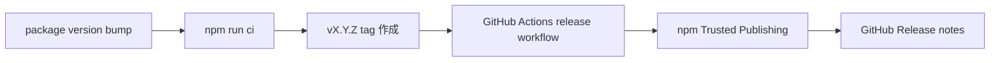

# AIGate 運用ドキュメント

[English](operations.en.md) | [한국어](operations.ko.md) | [日本語](operations.ja.md) | [中文](operations.zh.md)

このドキュメントは、GitHub 上でソースコードではなく文書として読める
運用ガイドです。ビジュアル版 HTML は、ローカルで
`docs/aigate-overview.ja.html` を開くと確認できます。
そのまま実行できる command は [使い方ガイド](usage.ja.md) から始めてください。

## 全体の運用プロセス

```mermaid
flowchart LR
  A["aigate start を実行"] --> B["Git 変更を検出"]
  B --> C["aigate test を実行"]
  C --> D["失敗時は aitest を実行"]
  D --> E["範囲を絞って commit"]
  E --> F["検証付き push"]
  F --> G["PR 作成"]
  G --> H["CI 確認"]
  H --> I["main に merge"]
  I --> J["release check"]
  J --> K["tag release"]
  K --> L["npm publish"]
```



## リリースプロセス



## コマンドマップ

| 領域 | コマンド |
| --- | --- |
| Setup | `start`, `start --route oss`, `init`, `setup`, `settings`, `integrate` |
| First run | `doctor`, `demo`, `install-hook --pre-push` |
| Guard gates | `check`, `test`, `aitest`, `git-ready`, `push`, `pr` |
| Reports | `ai report`, `pr-check`, `report`, `evaluate-project`, `compliance-report`, `dashboard`, `audit-report` |
| Release | `release-check`, `release-check --npm`, `branch-strategy`, `branch-strategy --compare`, `notify` |

## 代表的な実行手順

```sh
npm install -g aigate-cli
aigate setup --language ja
aigate ai report
aigate start --route oss --dry-run
aigate start --route ai --provider all
git switch -c feature/my-change
aigate doctor
aigate install-hook --pre-push
aigate test
aigate aitest
aigate git-ready
git add <files>
git commit -m "feat: short summary"
aigate push -u origin feature/my-change
aigate pr-check --output .aigate/reports/pr.md
aigate pr --title "feat: short summary"
aigate github comment --pr <number>
aigate github check --output .aigate/reports/github-check.md
aigate trends record
aigate compliance-report --output .aigate/reports/compliance.md
aigate dashboard --output .aigate/reports/dashboard.html
aigate branch-strategy --compare
aigate github setup --owner @your-org/team --dry-run
aigate release-check --npm
```

## 現在実装済み

- npm package `aigate-cli` の公開配布と `npx` 実行
- `aigate start` によるガイド付き開始ルート
- `aigate start --route oss` によるオープンソース初期ファイル生成
- `aigate doctor` による初回実行 diagnostics
- `aigate demo` によるガイド付き CLI demo
- `aigate install-hook --pre-push` による pre-push hook installation
- Git changed-file と untracked-file の readiness check
- `aigate test` による project test automation
- `aigate ai report` による AI プロジェクト状態ブリーフ
- `aigate aitest` による AI 修正プロンプトと任意の agent 実行
- secret pattern detection と SARIF output
- `git-ready`、guarded push、guarded PR creation
- `aigate github` による GitHub PR コメントと Checks サマリー
- `aigate github setup` による PR テンプレートと CODEOWNERS 設定
- `action.yml` による再利用可能な公開 GitHub Action
- Markdown, HTML, JSON, SARIF reports
- コンプライアンスレポートとローカル HTML ヘルスダッシュボード
- project score と deep Git signal evaluation
- `aigate trends` によるプロジェクト状態トレンド履歴
- ブランチ戦略推薦、提案比較、ポリシーパック生成
- Codex/Gemini/Claude Code integration file generation
- 英語、韓国語、日本語、中国語の CLI settings
- release-check と npm Trusted Publishing workflow
- Terminal, Slack BLOCK, Discord, Teams, email, Linear, Jira notifications
- GHCR Docker publish workflow と Homebrew formula draft

## 今後の予定

- タグ付き GHCR workflow 実行後の public Docker image
- Homebrew tap publish
- standalone binary
- Linear/Jira workflow integrations の深化
- organization dashboard と enterprise governance packs
