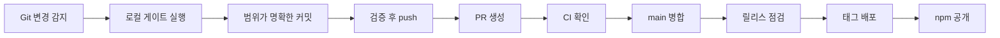
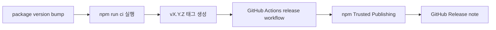

# AIGate 운영 문서

[English](operations.en.md) | [한국어](operations.ko.md) | [日本語](operations.ja.md) | [中文](operations.zh.md)

이 문서는 GitHub에서 코드가 아니라 문서로 바로 읽을 수 있는 운영 문서입니다.
시각형 HTML 문서는 로컬에서 `docs/aigate-overview.ko.html` 파일을 열어 확인할 수 있습니다.

## 전체 운영 프로세스



## 릴리스 프로세스



## 명령어 맵

| 영역 | 명령어 |
| --- | --- |
| 설정 | `init`, `setup`, `settings`, `integrate` |
| 첫 실행 | `doctor`, `demo`, `install-hook --pre-push` |
| 보호 게이트 | `check`, `git-ready`, `push`, `pr` |
| 리포트 | `pr-check`, `report`, `evaluate-project`, `audit-report` |
| 릴리스 | `release-check`, `release-check --npm`, `branch-strategy`, `notify` |

## 대표 실행 경로

```sh
npm install -g aigate-cli
aigate setup --language ko
git switch -c feature/my-change
aigate doctor
aigate install-hook --pre-push
aigate git-ready
git add <files>
git commit -m "feat: short summary"
aigate push -u origin feature/my-change
aigate pr-check --output .aigate/reports/pr.md
aigate pr --title "feat: short summary"
aigate github comment --pr <number>
aigate github check --output .aigate/reports/github-check.md
aigate trends record
aigate github setup --owner @your-org/team --dry-run
aigate release-check --npm
```

## 현재 구현된 기능

- npm 패키지 `aigate-cli` 공개 배포와 `npx` 실행
- `aigate doctor` 기반 첫 실행 환경 진단
- `aigate demo` 기반 안내형 CLI 데모
- `aigate install-hook --pre-push` 기반 pre-push hook 설치
- Git 변경 파일과 untracked 파일 기반 readiness check
- secret 패턴 탐지와 SARIF 출력
- `git-ready`, guarded push, guarded PR 생성 흐름
- `aigate github` 기반 GitHub PR 댓글과 Checks 요약
- `aigate github setup` 기반 PR 템플릿과 CODEOWNERS 설정
- `action.yml` 기반 재사용 가능한 공개 GitHub Action
- Markdown, HTML, JSON, SARIF 리포트
- 프로젝트 점수와 deep Git signal 평가
- `aigate trends` 기반 프로젝트 상태 추세 기록
- 브랜치 전략 추천과 정책 초안 생성
- Codex/Gemini 통합 파일 생성
- 영어, 한국어, 일본어, 중국어 CLI 설정
- release-check와 npm Trusted Publishing workflow
- 터미널, Slack BLOCK, Discord, Teams webhook 알림

## 미래에 구현할 기능

- 공개 Docker image
- Homebrew formula
- standalone binary
- Linear/Jira 연동
- hosted dashboard와 엔터프라이즈 거버넌스 pack
