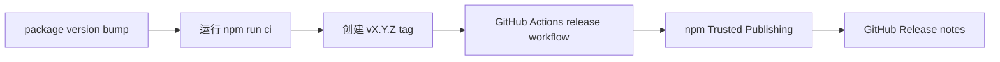

# AIGate 运维说明

[English](operations.en.md) | [한국어](operations.ko.md) | [日本語](operations.ja.md) | [中文](operations.zh.md)

这是一份可以在 GitHub 上直接阅读的 Markdown 运维说明，不会像 HTML 文件那样显示为源码。
可视化 HTML 版本可以在本地打开 `docs/aigate-overview.zh.html` 查看。
可直接复制运行的命令请先看 [使用指南](usage.zh.md)。

## 整体运行流程

```mermaid
flowchart LR
  A["运行 aigate start"] --> B["检测 Git 变更"]
  B --> C["运行 aigate test"]
  C --> D["失败时运行 aitest"]
  D --> E["提交聚焦的 commit"]
  E --> F["验证后 push"]
  F --> G["创建 PR"]
  G --> H["检查 CI"]
  H --> I["合并到 main"]
  I --> J["release check"]
  J --> K["tag release"]
  K --> L["npm publish"]
```



## 发布流程



## 命令地图

| 范围 | 命令 |
| --- | --- |
| Setup | `start`, `init`, `setup`, `settings`, `integrate` |
| First run | `doctor`, `demo`, `install-hook --pre-push` |
| Guard gates | `check`, `test`, `aitest`, `git-ready`, `push`, `pr` |
| Reports | `pr-check`, `report`, `evaluate-project`, `compliance-report`, `dashboard`, `audit-report` |
| Release | `release-check`, `release-check --npm`, `branch-strategy`, `branch-strategy --compare`, `notify` |

## 典型执行路径

```sh
npm install -g aigate-cli
aigate setup --language zh
aigate start --route ai --provider all
git switch -c feature/my-change
aigate doctor
aigate install-hook --pre-push
aigate test
aigate aitest
aigate git-ready
git add <files>
git commit -m "feat: short summary"
aigate push -u origin feature/my-change
aigate pr-check --output .aigate/reports/pr.md
aigate pr --title "feat: short summary"
aigate github comment --pr <number>
aigate github check --output .aigate/reports/github-check.md
aigate trends record
aigate compliance-report --output .aigate/reports/compliance.md
aigate dashboard --output .aigate/reports/dashboard.html
aigate branch-strategy --compare
aigate github setup --owner @your-org/team --dry-run
aigate release-check --npm
```

## 当前已实现

- npm package `aigate-cli` 公开发布并支持 `npx` 执行
- 通过 `aigate start` 提供引导式启动路由
- 通过 `aigate doctor` 提供首次运行诊断
- 通过 `aigate demo` 提供引导式 CLI demo
- 通过 `aigate install-hook --pre-push` 安装 pre-push hook
- Git changed-file 和 untracked-file readiness checks
- 通过 `aigate test` 提供项目测试自动化
- 通过 `aigate aitest` 提供 AI 修复提示和可选 agent 执行
- secret pattern detection 和 SARIF output
- `git-ready`、guarded push、guarded PR creation
- 通过 `aigate github` 发布 GitHub PR 评论并准备 Checks 摘要
- 通过 `aigate github setup` 设置 PR 模板和 CODEOWNERS
- 通过 `action.yml` 提供可复用的公开 GitHub Action
- Markdown, HTML, JSON, SARIF reports
- 合规报告和本地 HTML 健康仪表盘
- project score 和 deep Git signal evaluation
- 通过 `aigate trends` 记录项目状态趋势历史
- 分支策略推荐、提案比较和政策包生成
- Codex/Gemini/Claude Code integration file generation
- 英语、韩语、日语、中文 CLI settings
- release-check 和 npm Trusted Publishing workflow
- Terminal、Slack BLOCK、Discord、Teams、email、Linear、Jira notifications
- GHCR Docker publish workflow 和 Homebrew formula draft

## 后续计划

- 标签触发 GHCR workflow 后的 public Docker image
- Homebrew tap publish
- standalone binary
- 深化 Linear/Jira workflow integrations
- organization dashboard 和 enterprise governance packs
