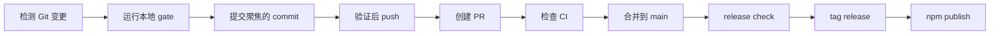
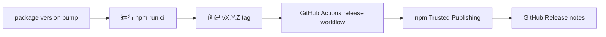

# AIGate 运维说明

[English](operations.en.md) | [한국어](operations.ko.md) | [日本語](operations.ja.md) | [中文](operations.zh.md)

这是一份可以在 GitHub 上直接阅读的 Markdown 运维说明，不会像 HTML 文件那样显示为源码。
可视化 HTML 版本可以在本地打开 `docs/aigate-overview.zh.html` 查看。

## 整体运行流程



## 发布流程



## 命令地图

| 范围 | 命令 |
| --- | --- |
| Setup | `init`, `setup`, `settings`, `integrate` |
| First run | `doctor`, `demo`, `install-hook --pre-push` |
| Guard gates | `check`, `git-ready`, `push`, `pr` |
| Reports | `pr-check`, `report`, `evaluate-project`, `audit-report` |
| Release | `release-check`, `release-check --npm`, `branch-strategy`, `notify` |

## 典型执行路径

```sh
npm install -g aigate-cli
aigate setup --language zh
git switch -c feature/my-change
aigate doctor
aigate install-hook --pre-push
aigate git-ready
git add <files>
git commit -m "feat: short summary"
aigate push -u origin feature/my-change
aigate pr-check --output .aigate/reports/pr.md
aigate pr --title "feat: short summary"
aigate release-check --npm
```

## 当前已实现

- npm package `aigate-cli` 公开发布并支持 `npx` 执行
- 通过 `aigate doctor` 提供首次运行诊断
- 通过 `aigate demo` 提供引导式 CLI demo
- 通过 `aigate install-hook --pre-push` 安装 pre-push hook
- Git changed-file 和 untracked-file readiness checks
- secret pattern detection 和 SARIF output
- `git-ready`、guarded push、guarded PR creation
- Markdown, HTML, JSON, SARIF reports
- project score 和 deep Git signal evaluation
- branch strategy recommendation 和 policy draft generation
- Codex/Gemini integration file generation
- 英语、韩语、日语、中文 CLI settings
- release-check 和 npm Trusted Publishing workflow
- Terminal, Slack BLOCK, Discord, Teams webhook notifications

## 后续计划

- 公开 Docker image
- Homebrew formula
- standalone binary
- GitHub PR comments 和 GitHub Checks reporter
- 每周 team report 和 trend analytics
- Linear/Jira integrations
- hosted dashboard 和 enterprise governance packs
